# 🌟 Welcome to Heshan's Digital Universe! 

<div align="center">
  
</div>

<div align="center">
  
</div>

<div align="center">
  
  [](https://github.com/heshansathyanga)
  [](https://github.com/heshansathyanga)
  [](https://github.com/heshansathyanga)
  
</div>

---

<div align="center">
  
## 🎯 Quick Overview

<table>
<tr>
<td align="center" width="33%">

<br><strong>Experience</strong>
<br>4+ Years
</td>
<td align="center" width="33%">

<br><strong>Location</strong>
<br>🇱🇰 Sri Lanka
</td>
<td align="center" width="33%">

<br><strong>Focus</strong>
<br>Full Stack & Innovation
</td>
</tr>
</table>

</div>

---

## 🧬 About Me


<div align="left">

```javascript
const heshansathyanga = {
    name: "Heshan Sathyanga",
    title: "Software Engineer & Tech Enthusiast",
    location: "Colombo, Sri Lanka 🇱🇰",
    experience: "4+ years in software development",
    
    currentFocus: [
        "Building scalable web applications",
        "Clean architecture & best practices", 
        "Open source contributions",
        "Continuous learning & innovation"
    ],
    
    lifePhilosophy: "Code with passion, learn continuously, share knowledge! ✨",
    
    dailyRoutine: {
        "06:00": "☕ Coffee + Planning",
        "08:00": "💻 Deep Work & Development", 
        "14:00": "🔍 Code Reviews & Collaboration",
        "18:00": "📚 Learning & Research",
        "21:00": "🌙 Open Source & Side Projects"
    },
    
    motivations: [
        "Clean, maintainable code",
        "Solving complex problems",
        "Helping others grow",
        "Building impactful solutions"
    ]
};

console.log("Welcome to my digital world! 🌟");
```

### 🎯 What Drives Me
- **🏗️ Clean Architecture**: Crafting maintainable and scalable solutions
- **📈 Continuous Growth**: Always learning new technologies and methodologies  
- **🤝 Community Impact**: Contributing to open source and mentoring developers
- **⚡ Innovation**: Transforming complex problems into elegant solutions

</div>

<br clear="both" />

---

## 🛠️ Tech Arsenal

<div align="center">

### 💻 Programming Languages


### 🚀 Frameworks & Libraries


### 🎨 Frontend Technologies  


### 🗄️ Databases & Backend


### ☁️ DevOps & Cloud


### 🔧 Development Tools


### 🧪 Testing & Quality


### 📊 Monitoring & Analytics


</div>

---

## 📊 GitHub Analytics & Insights

<div align="center">

### 📈 Performance Overview


### 🔥 Contribution Activity


### 📊 Detailed Activity Graph


</div>

---

## 🏆 Achievements & Recognition

<div align="center">
  


</div>

<div align="center">

### 🎯 Career Milestones

<table>
<tr>
<td align="center" width="25%">

<br><strong>4+ Years</strong>
<br>Development Experience
</td>
<td align="center" width="25%">

<br><strong>Multiple</strong>
<br>Technologies Mastered
</td>
<td align="center" width="25%">

<br><strong>Open Source</strong>
<br>Contributions
</td>
<td align="center" width="25%">

<br><strong>Innovation</strong>
<br>Focused Solutions
</td>
</tr>
</table>

</div>

---

## 🎯 Current Goals & Roadmap

<div align="center">

### 🚀 2024-2025 Objectives

```mermaid
graph TD
    A[🎯 Current Goals] --> B[🏗️ System Architecture]
    A --> C[📱 Mobile Development]
    A --> D[🤖 AI/ML Integration]
    A --> E[🌍 Open Source]
    
    B --> B1[Microservices Mastery]
    B --> B2[Cloud Native Apps]
    
    C --> C1[React Native]
    C --> C2[Flutter Exploration]
    
    D --> D1[Machine Learning APIs]
    D --> D2[AI-Powered Features]
    
    E --> E1[Major Contributions]
    E --> E2[Community Building]
    
    style A fill:#00D4FF,stroke:#333,stroke-width:3px,color:#000
    style B fill:#FF6B6B,stroke:#333,stroke-width:2px
    style C fill:#4ECDC4,stroke:#333,stroke-width:2px
    style D fill:#45B7D1,stroke:#333,stroke-width:2px
    style E fill:#96CEB4,stroke:#333,stroke-width:2px
```



</div>

<div align="center">

### 📅 Learning Journey

| Quarter | Focus Area | Status |
|---------|------------|---------|
| Q1 2024 | ⚗️ Advanced Python & Django | 🔄 In Progress |
| Q2 2024 | ☁️ Cloud Architecture (AWS/GCP) | 📋 Planned |
| Q3 2024 | 📱 Mobile Development | 📋 Planned |
| Q4 2024 | 🤖 AI/ML Integration | 📋 Planned |

</div>

---

## 🌐 Let's Connect & Collaborate!

<div align="center">

### 📬 Reach Out To Me

<table>
<tr>
<td align="center">
<a href="https://linkedin.com/in/heshansathyanga">

</a>
<br><strong>Professional Network</strong>
</td>
<td align="center">
<a href="https://instagram.com/heshan.dev">

</a>
<br><strong>Visual Updates</strong>
</td>
<td align="center">
<a href="https://twitter.com/heshansathyanga">

</a>
<br><strong>Tech Discussions</strong>
</td>
</tr>
<tr>
<td align="center">
<a href="https://youtube.com/@heshansathyanga">

</a>
<br><strong>Tutorials & Tips</strong>
</td>
<td align="center">
<a href="https://t.me/heshansathyanga">

</a>
<br><strong>Quick Chat</strong>
</td>
<td align="center">
<a href="mailto:heshan@example.com">

</a>
<br><strong>Professional Inquiries</strong>
</td>
</tr>
</table>

### 💼 Open for Opportunities
- 🚀 **Full-time positions** in software engineering
- 🤝 **Collaboration** on interesting projects  
- 📝 **Freelance work** and consulting
- 🎓 **Mentoring** aspiring developers
- 🗣️ **Speaking** at tech events and conferences

</div>

---

## 💡 Random Dev Wisdom

<div align="center">
  


</div>

---

## 🎮 Fun Facts & Interests

<div align="center">

<table>
<tr>
<td align="center" width="50%">

<br>
<strong>⚡ Quick Facts</strong>
<br><br>
🐛 I debug with console.log() and proud of it!<br>
☕ Coffee consumption: ~5 cups/day<br>
🌙 Night owl developer (best code after 10 PM)<br>
📚 Always have 3+ tech books on my reading list<br>
🎵 Code with Lo-fi Hip Hop playlists<br>
</td>
<td align="center" width="50%">

<br>
<strong>🎯 When I'm Not Coding</strong>
<br><br>
🎮 Gaming (strategy & puzzle games)<br>
📖 Reading tech blogs & documentation<br>
🌱 Learning new programming languages<br>
🔧 Building side projects for fun<br>
🏃‍♂️ Running & staying active<br>
</td>
</tr>
</table>

</div>

---

## 📊 Weekly Development Breakdown

<!--START_SECTION:waka-->
```text
JavaScript   █████████░░░░░░░░░░░░░   35.2%
Python       ███████░░░░░░░░░░░░░░░   28.4%
C#           █████░░░░░░░░░░░░░░░░░   18.7%
HTML/CSS     ███░░░░░░░░░░░░░░░░░░░   12.3%
Others       █░░░░░░░░░░░░░░░░░░░░░    5.4%
```
<!--END_SECTION:waka-->

---

<div align="center">

### 🙏 Thank You for Visiting!


**"Every great developer you know got there by solving problems they were unqualified to solve until they actually did it."** - Patrick McKenzie

---


</div>
